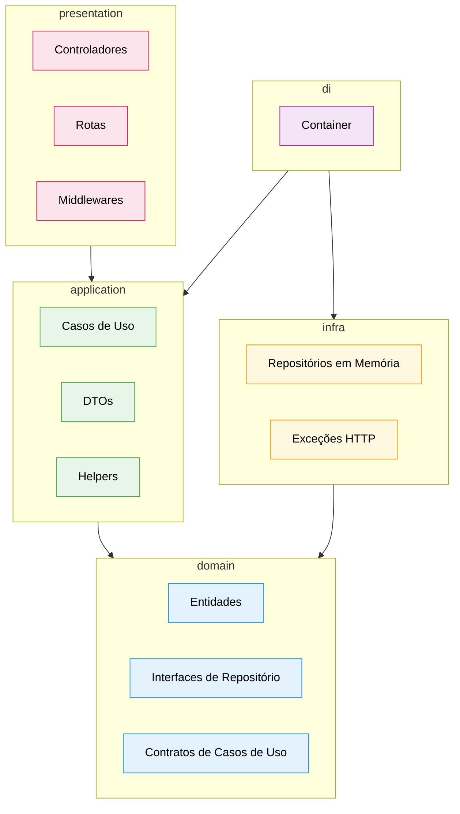

# Diagrama 01 — Camadas da Clean Architecture

## Explicação

O projeto é organizado em cinco diretórios de código com responsabilidades estritamente separadas. A regra central é que o fluxo de dependência aponta sempre para dentro — camadas externas conhecem as internas, mas o inverso nunca ocorre.

- **domain** é o núcleo: contém entidades, interfaces de repositório e contratos de casos de uso. Não importa nada de fora.
- **application** implementa os casos de uso. Depende apenas do domínio — nunca de Express, TypeORM ou qualquer framework.
- **infra** fornece as implementações concretas dos repositórios e os primitivos de exceção HTTP. Depende dos contratos definidos no domínio.
- **presentation** trata das requisições HTTP: controllers, rotas e middleware de erro. Depende das interfaces da camada de aplicação.
- **di** é o ponto de composição: registra e conecta todas as dependências via TSyringe. Conhece application e infra, mas nenhuma das camadas de negócio o conhece.

## Diagrama

