# Diagrama 02 — Fluxo de criação de utilização de veículo

## Explicação

A criação de uma utilização é o fluxo central do sistema e concentra as duas regras de negócio principais: um veículo não pode estar em uso simultâneo por mais de um motorista, e um motorista não pode conduzir mais de um veículo ao mesmo tempo.

O caso de uso executa quatro verificações em sequência antes de persistir o registro:

1. O veículo informado existe?
2. O motorista informado existe?
3. O veículo já possui uma utilização ativa (sem `endDate`)?
4. O motorista já possui uma utilização ativa em outro veículo?

Qualquer falha interrompe o fluxo com o código de status adequado. Apenas se todas as verificações passarem o registro é criado com a `startDate` do momento da requisição.

## Diagrama

```mermaid
%%{init: {'theme': 'dark'}}%%
sequenceDiagram
    actor Client
    participant Controller as VehicleUsageController
    participant UseCase as CreateVehicleUsageUseCase
    participant VeiculoRepo as VehicleRepository
    participant MotoristaRepo as DriverRepository
    participant UsageRepo as VehicleUsageRepository

    Client->>Controller: POST /api/vehicle-usages
    Controller->>UseCase: execute(dto)

    rect rgb(63, 61, 56)
        note over UseCase: Verificação de existência
        UseCase->>VeiculoRepo: findById(vehicleId)
        alt veículo não encontrado
            VeiculoRepo-->>UseCase: null
            UseCase-->>Controller: NotFound
            Controller-->>Client: 404 Não Encontrado
        end

        UseCase->>MotoristaRepo: findById(driverId)
        alt motorista não encontrado
            MotoristaRepo-->>UseCase: null
            UseCase-->>Controller: NotFound
            Controller-->>Client: 404 Não Encontrado
        end
    end

    rect rgb(63, 61, 56)
        note over UseCase: Verificação de disponibilidade
        UseCase->>UsageRepo: findActiveByVehicleId(vehicleId)
        alt veículo já em uso
            UsageRepo-->>UseCase: utilização ativa
            UseCase-->>Controller: Conflict
            Controller-->>Client: 409 Conflito
        end

        UseCase->>UsageRepo: findActiveByDriverId(driverId)
        alt motorista já conduzindo outro veículo
            UsageRepo-->>UseCase: utilização ativa
            UseCase-->>Controller: Conflict
            Controller-->>Client: 409 Conflito
        end
    end

    rect rgb(63, 61, 56)
        note over UseCase: Criação
        UseCase->>UsageRepo: create(novaUtilizacao)
        UsageRepo-->>UseCase: utilização criada
        UseCase-->>Controller: utilização criada
        Controller-->>Client: 201 Criado
    end
```

