# Diagrama 03 — Fluxo de finalização de utilização de veículo

## Explicação

A finalização marca o encerramento de uma utilização ativa, registrando a `endDate` no momento da requisição. O fluxo é simples e linear, com duas verificações antes da atualização:

1. A utilização existe?
2. Ela já foi finalizada anteriormente (já possui `endDate`)?

Uma utilização já encerrada não pode ser finalizada novamente — isso evita sobrescrever a data de término original com um valor incorreto. Após a atualização, o veículo e o motorista ficam disponíveis para novas utilizações.

## Diagrama

```mermaid
%%{init: {'theme': 'dark'}}%%
sequenceDiagram
    actor Client
    participant Controller as VehicleUsageController
    participant UseCase as FinishVehicleUsageUseCase
    participant Repo as VehicleUsageRepository

    Client->>Controller: PATCH /api/vehicle-usages/:id/finish
    Controller->>UseCase: execute({ id })

    rect rgb(63, 61, 56)
        note over UseCase: Validações
        UseCase->>Repo: findById(id)
        alt utilização não encontrada
            Repo-->>UseCase: null
            UseCase-->>Controller: NotFound
            Controller-->>Client: 404 Não Encontrado
        end

        alt utilização já finalizada
            UseCase-->>Controller: UnprocessableContent
            Controller-->>Client: 422 Unprocessable Content
        end
    end

    rect rgb(63, 61, 56)
        note over UseCase: Finalização
        UseCase->>Repo: update(id, { endDate: agora })
        Repo-->>UseCase: utilização atualizada
        UseCase-->>Controller: utilização atualizada
        Controller-->>Client: 200 OK
    end
```

