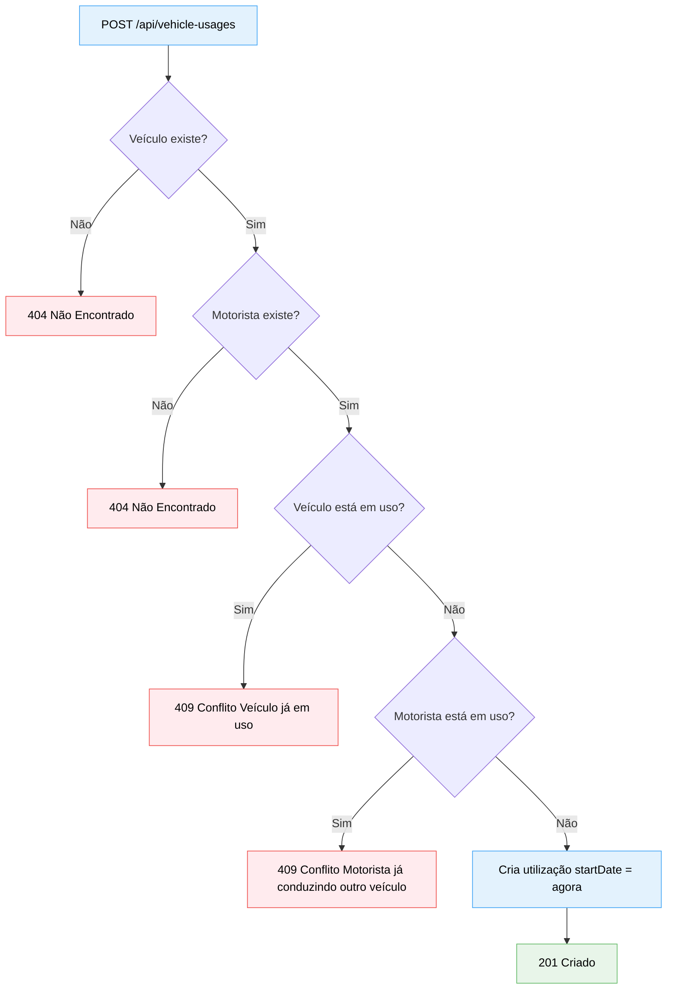

# Diagrama 04 — Regras de negócio: conflitos de disponibilidade

## Explicação

Este diagrama consolida as regras de negócio que governam a disponibilidade de veículos e motoristas no momento de criar uma nova utilização.

Há dois tipos de conflito possíveis:

- **Veículo ocupado:** o veículo solicitado já possui uma utilização sem `endDate`, ou seja, está em uso por outro motorista no momento da requisição.
- **Motorista ocupado:** o motorista solicitado já está associado a uma utilização ativa em outro veículo.

Ambos resultam em `409 Conflict` com mensagens distintas para que o cliente saiba exatamente qual restrição foi violada. As verificações de existência (404) ocorrem antes das verificações de conflito (409).

## Diagrama

