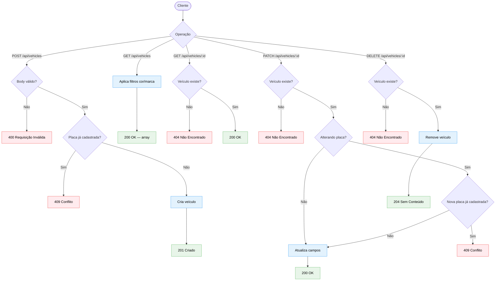

# Diagrama 05 — Fluxo CRUD de veículos

## Explicação

Este diagrama cobre o ciclo de vida completo de um veículo no sistema: criação, leitura, atualização e remoção. A criação e a atualização incluem verificação de unicidade de placa, que é a única restrição de negócio aplicada a este recurso além da validação de campos obrigatórios.

A listagem suporta filtros opcionais por `color` e `brand`, aplicados via busca parcial sem distinção de maiúsculas e minúsculas.

## Diagrama

