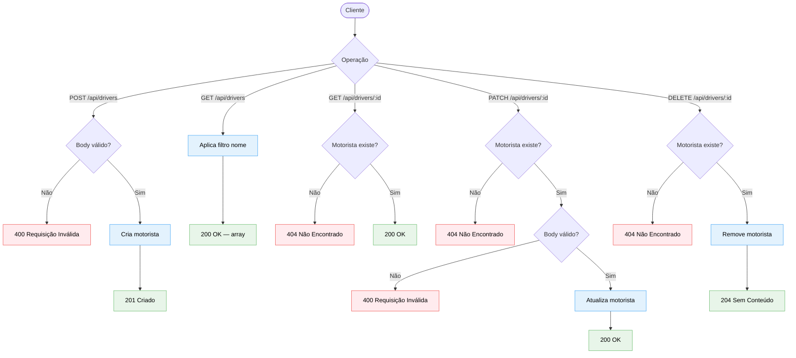

# Diagrama 06 — Fluxo CRUD de motoristas

## Explicação

Este diagrama cobre o ciclo de vida completo de um motorista no sistema: criação, leitura, atualização e remoção. O recurso de motoristas é o mais simples da API — não possui restrições de unicidade além da validação do campo `name` como obrigatório na criação.

A listagem suporta filtro opcional por `name`, aplicado via busca parcial sem distinção de maiúsculas e minúsculas.

## Diagrama

