# Diagrama 07 — Ciclo de vida completo de uma utilização

## Explicação

Este diagrama ilustra o fluxo completo de ponta a ponta: desde o cadastro de um veículo e de um motorista até a finalização de uma utilização. É o cenário mais representativo do sistema, pois envolve os três recursos e as duas regras de negócio centrais.

O caminho feliz segue sempre a ordem: veículo cadastrado → motorista cadastrado → utilização iniciada → utilização finalizada. Qualquer desvio em uma etapa impede o avanço para a próxima.

## Diagrama

```mermaid
%%{init: {'theme': 'dark'}}%%
sequenceDiagram
    actor Client

    rect rgb(63, 61, 56)
        note over Client: 1. Cadastro de recursos
        Client->>+API: POST /api/vehicles
        API-->>-Client: 201 — vehicle.id

        Client->>+API: POST /api/drivers
        API-->>-Client: 201 — driver.id
    end

    rect rgb(63, 61, 56)
        note over Client: 2. Início da utilização
        Client->>+API: POST /api/vehicle-usages
        note right of Client: { vehicleId, driverId, reason }

        API->>API: Verifica veículo existe
        API->>API: Verifica motorista existe
        API->>API: Verifica veículo disponível
        API->>API: Verifica motorista disponível

        API-->>-Client: 201 — usage.id, startDate, endDate: null
    end

    rect rgb(63, 61, 56)
        note over Client: 3. Consultas durante o uso
        Client->>+API: GET /api/vehicle-usages
        API-->>-Client: 200 — lista com endDate: null

        Client->>+API: GET /api/vehicles/vehicle.id
        API-->>-Client: 200 — dados do veículo
    end

    rect rgb(63, 61, 56)
        note over Client: 4. Finalização
        Client->>+API: PATCH /api/vehicle-usages/usage.id/finish
        API->>API: Verifica utilização existe
        API->>API: Verifica se já finalizada

        API-->>-Client: 200 — endDate preenchido

        note over Client: Veículo e motorista ficam disponíveis para nova utilização
    end
```

